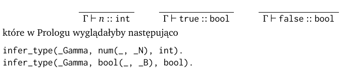
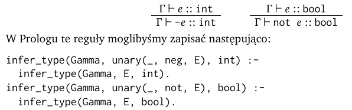
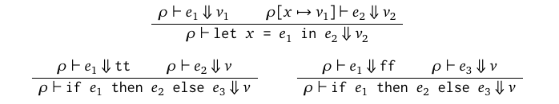
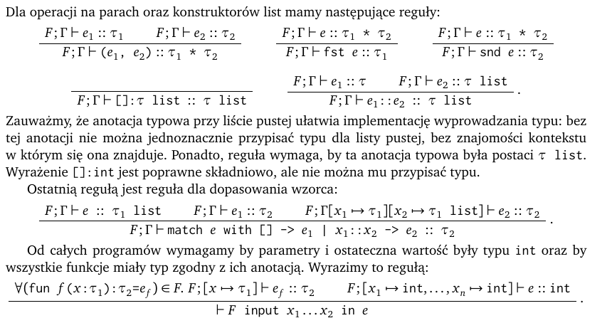
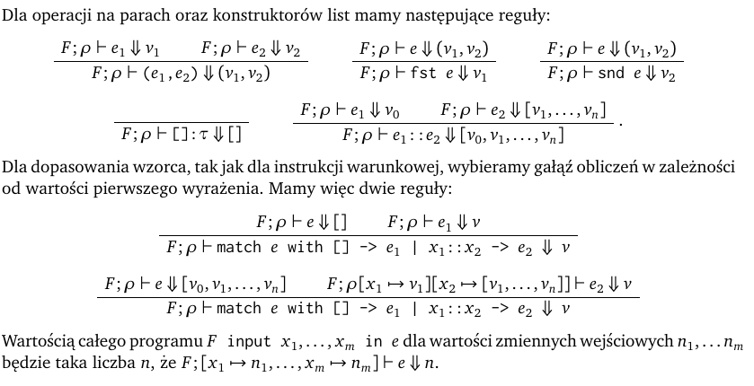
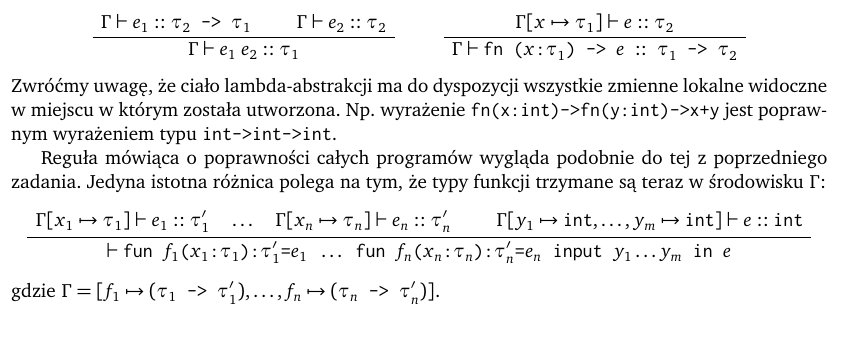
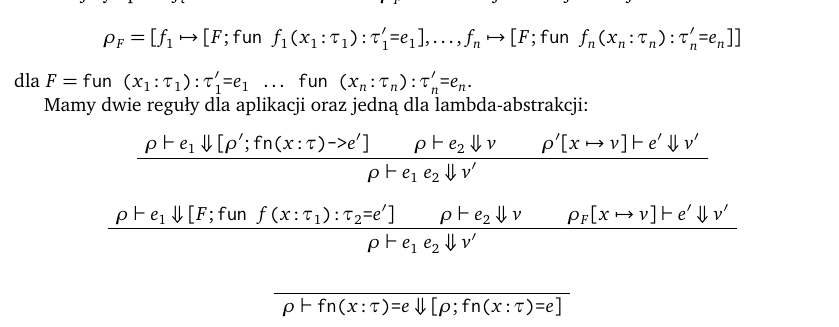

# TypeCheckEval-PPLanguage
:muscle: :fire: :thumbsup:
One of the greatest thing that I have created.  My lecturers have invented the arithmetic logic programming language called as PP. We had to create parser, type check and eval which let you play with that language.

If you want to know something more about language go to prac4, prac5, prac6 pdf files (eveyrthing in polish language) where You can find some informations. 
If you want to check out solution click click [here](SOLUTION.hs)

- 1st stage - simple logic and arithmetic
- 2nd stage - functions, matching list, pairs, projections
- 3rd stage - lambdas, applications and everything above

##DESCRIPTION :point_down: 

HOW DID I DEVELOP THAT LANGUAGE?

 #- 1st stage
 
    It was simple language which let You sum, substract, multiply etc but also You could do some logic like: if true then x else y.
  Simple program: 
   "input x in if not not true then x * 1 else x div 1"
   Here You have Type system of constant and unary operators: 
   
   
   ------------------------------------------------------------------------------------------------------------------------
   
   
   ------------------------------------------------------------------------------------------------------------------------
   Semantic of If and Let statement: 
   
   
   ------------------------------------------------------------------------------------------------------------------------
 #- 2nd stage
    
    Here fun begins!! :wink: We added to our language functions, unit statement, matching list, pairs, projections of pairs.
    
    Type system: 
    
    
    ------------------------------------------------------------------------------------------------------------------------
    And its semantic: 
    
    
    ------------------------------------------------------------------------------------------------------------------------
 #- 3rd stage 
 
   Now we are going to have lambda-abstractions, applications and everything from previous stages. 
    
    Type system of lambdas: 
    
    
    ------------------------------------------------------------------------------------------------------------------------
    And its semantic: 
    
    
    ------------------------------------------------------------------------------------------------------------------------
   
